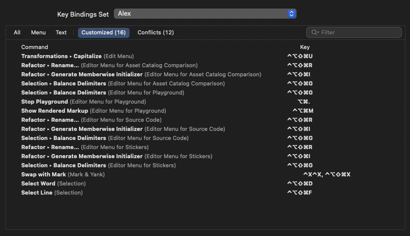

# SetupXcode

### 0xAlex's 🎨 Color Scheme, ⌨️ KeyBindings, and other Xcode stuffs.

This package contains the Xcode theme and keybindings I use.  Since they are 
the greatest of all time, I made it public so others can experience the glory.

I have various machines, work locations, and installs, so I use this executable
and others like it to quickly adjust my Xcode stuff when the machine isn't set 
up yet.  Use it as a starting point if you want to do something similar.
_(Another obvious use-case: Steal this and modify a private one to rapidly prank 
your victi... friends who leave their IDE unattended)_

## Some Juicy Samples of the-only-theme-you-could-ever-want™

> - This very pack's install script
>> 
>
> - A randomly selected Leetcode question to show-off this amazing syntax coloring
>> 
>
> - It takes a lot for me to customize a binding... I use these all the time
>> 
>
> - Random Swift file with a declaration highlighted
>> 
>
> - Metal Shading Language colors
>> 
>
> - Literally this markdown file in Xcode
>> 

## Install using SPM if you're a 1337_hax0r

Clone the repo and execute the pack with `swift run`

```
$ git clone https://github.com/The-0xAlex/SetupXcode.git
$ cd SetupXcode
$ swift run
```

Gotta get your hygeine on, so bathe afterwords:

```
$ cd ..
$ rm -rf SetupXcode
```


## Install manually to burn calories and time

1. Clone this repo:
```
$ git clone https://github.com/The-0xAlex/SetupXcode.git
```

2. Create a directory at this path if it doesn't exist already:
```
~/Library/Developer/Xcode/UserData/FontAndColorThemes
```

3. Copy the file `0xAlex.xccolortheme` from the repo into that folder.

4. Create a directory at this path if it doesn't exist already:
```
~/Library/Developer/Xcode/UserData/KeyBindings
```

5. Copy the file `0xAlex.idekeybindings` from the repo into that folder.

6. **Realize you'll never get that time back and you should have just run 
   the script.**

## Attributions

I have a ton of things like this that I use to EZ-bake my environments on 
different OSes for various stuff.  I'm sure I got implementation ideas from 
somewhere, so if it was you open a ticket and your name will appear here.
