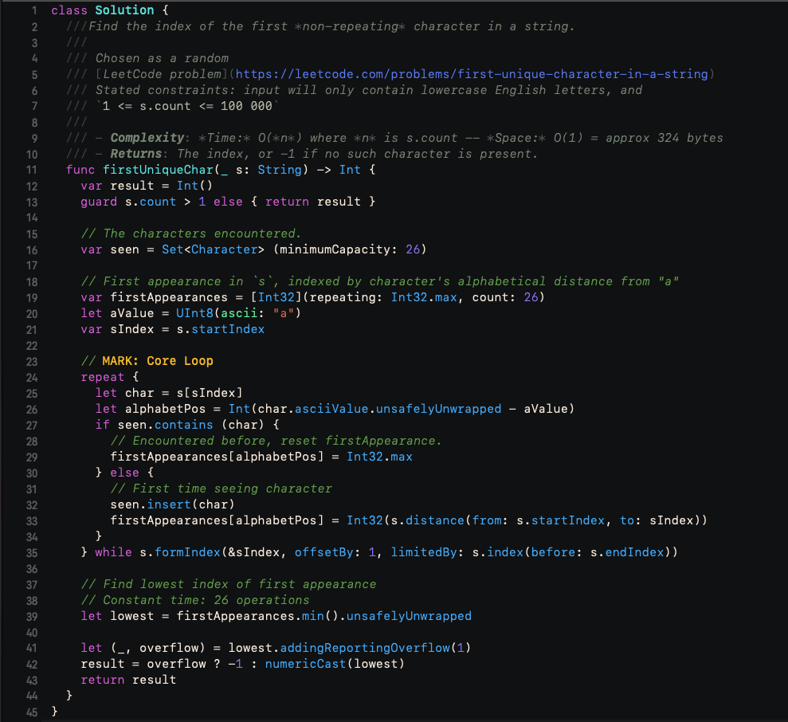

# SetupXcode

### 0xAlex's 🎨 Color Scheme, ⌨️ KeyBindings, and other Xcode stuffs.

This package contains the Xcode theme and keybindings I use.  Since they are 
the greatest of all time, I made it public so others can experience the glory.

I have various machines, work locations, and installs, so I use this executable
to quickly adjust my Xcode elsewhere.  _(Another obvious use-case: Take this 
and make a private one to rapidly prank your victi... friends who leave their 
IDE unattended)_

## Some Juicy Samples:





## Install using SPM

The easiest way to install is to clone the repo and execute the pack 
with `swift run`:

```
$ git clone https://github.com/The-0xAlex/SetupXcode.git
$ cd SetupXcode
$ swift run
```

Gotta get your hygeine on, so bathe afterwords:

```
$ cd ..
$ rm -rf SetupXcode
```

## Install manually to burn calories

You can also choose to do things manually if you want to be weird:

1. Clone this repo:
```
$ git clone https://github.com/The-0xAlex/SetupXcode.git
```

2a. Create a directory at this path if it doesn't exist already:
```
~/Library/Developer/Xcode/UserData/FontAndColorThemes
```

2b. Copy the file `0xAlex.xccolortheme` from the repo into that folder.

3a. Create a directory at this path if it doesn't exist already:
```
~/Library/Developer/Xcode/UserData/KeyBindings
```

3b. Copy the file `0xAlex.idekeybindings` from the repo into that folder.

4. Realize you'll never get that time back and you should have just ran 
the script.

## Attributions

I have a ton of things like this that I use to EZ-bake my environments on 
different OSes for various stuff.  I'm sure I got implementation ideas from 
somewhere, so if it was you open a ticket and your name will appear here.
